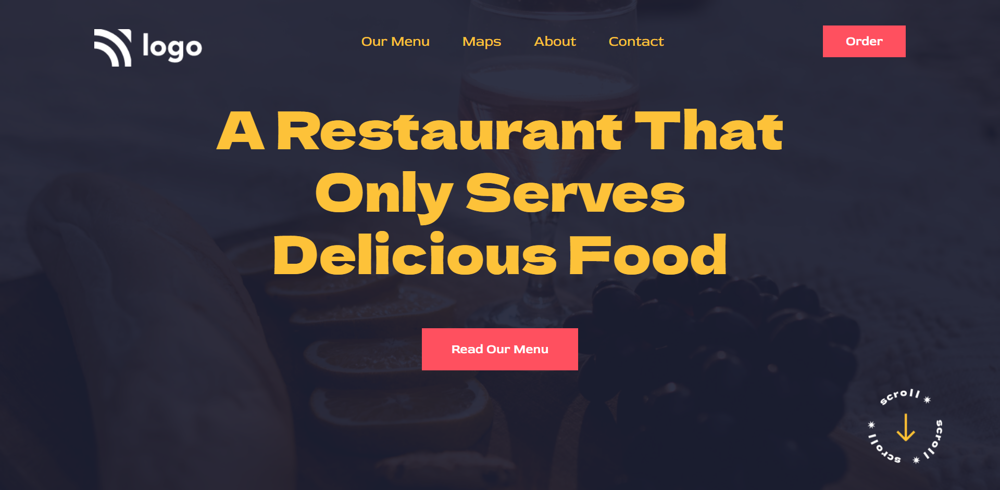

# Food Restaurant Home Page

## Project 02 🚀 Website's Live [Link](https://food-home-page.netlify.app)🔗

>by Arpit Pathak

Screenshot

## What I learned from this Project? 

- Learned to use CSS position (Absolute & Fixed) property.
- Learned to create Semi-transparent color layer over background-image using ::before pseudo element.
- Learned about opacity property to specifies the transparency of color layer.
- Learned about the z-index property to specifies the stack order of an element.

## Time taken to finish this project ⏳
- 1.5 hours
---

